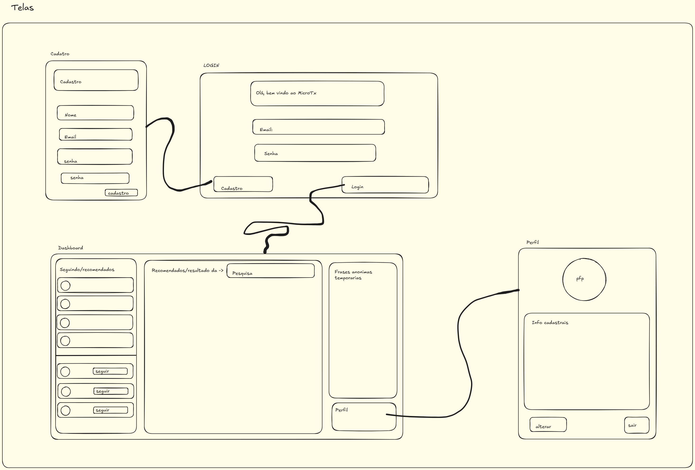

# MicroTx — Rede Social de Microtextos

## 1) Problema
Usuários de redes sociais, especialmente estudantes e jovens, têm dificuldade em encontrar um espaço leve para compartilhar pensamentos curtos sem distrações excessivas.
Isso causa perda de engajamento e sobrecarga de informações irrelevantes.
No início, o foco será usuários que querem publicar e acompanhar mensagens rápidas com o objetivo de criar uma timeline simples, com posts temporários e frases anônimas.

## 2) Atores e Decisores (quem usa / quem decide)
Usuários principais: Estudantes, jovens e qualquer pessoa que queira trocar microtextos
Decisores/Apoiadores: Administradores; equipe de desenvolvimento

## 3) Casos de uso (de forma simples)
Todos: Logar/deslogar; Manter dados cadastrais;
Usuário:
- Criar, editar e remover posts
- Pesquisar por posts ou usuários
- Seguir outros usuários
- Postar frases temporárias e/ou anônimas
- Visualizar perfil (dados cadastrais)
- Alterar informações do perfil

<!-- TODO -->
## 4) Limites e suposições
<!-- Simples assim:
     - Limites = regras/prazos/obrigações que você não controla.
     - Suposições = coisas que você espera ter e podem falhar.
     - Plano B = como você segue com a 1ª fatia se algo falhar.
     EXEMPLO:
     Limites: entrega final até o fim da disciplina (ex.: 2025-11-30); rodar no navegador; sem serviços pagos.
     Suposições: internet no laboratório; navegador atualizado; acesso ao GitHub; 10 min para teste rápido.
     Plano B: sem internet → rodar local e salvar em arquivo/LocalStorage; sem tempo do professor → testar com 3 colegas. -->
Limites: [prazo final], [regras/tecnologias obrigatórias], [restrições]  
Suposições: [internet/navegador/GitHub/tempo de teste]  
Plano B: [como continua entregando a 1ª fatia se algo falhar]

<!-- TODO -->
## 5) Hipóteses + validação
H-Valor: Se os usuários puderem publicar posts curtos e temporários, então o engajamento melhora em quantidade de posts criados e interações na timeline.
Validação (valor): teste com 5 usuários; meta: ≥4 conseguem postar e ver posts sem ajuda.

H-Viabilidade: Com Java Spring Boot + React, carregar timeline leva até 2s.
Validação (viabilidade): medir no protótipo com 30 ações; meta: ≥27 de 30 ações em ≤2s.

## 6) Fluxo principal e primeira fatia
**Fluxo principal (curto):**  
1) Usuário se cadastra ou faz login → 2) Cria post ou frase temporária → 3) Sistema salva no banco → 4) Timeline mostra posts

**Primeira fatia vertical (escopo mínimo):**  
Inclui: cadastro/login, criar post, listar posts
Critérios de aceite:
- Criar post → aparece na timeline
- Post temporário → some após tempo definido
- Cadastro → usuário pode logar em seguida

## 7) Esboços de telas do sistema (wireframes)


<!-- TODO -->
## 8) Tecnologias

<!-- TODO -->
### 8.1 Navegador
**Navegador:** React + TailwindCSS
**Armazenamento local (se usar):** LocalStorage (para sessão)
**Hospedagem:** execução local via Docker

<!-- TODO -->
### 8.2 Front-end (servidor de aplicação, se existir)
**Front-end (servidor):** React
**Hospedagem:** container Docker

### 8.3 Back-end (API/servidor, se existir)
- **Back-end (API):** Spring Boot (Java 21)
- **Banco de dados:** PostgreSQL (17.6)
- **Acesso ao BD:** Spring Data JPA (Hibernate)
- **Migrações do Banco de Dados:** Liquibase
- **Segurança:** Spring Security com autenticação via Token JWT
- **Deploy do back-end:** ambos rodando em containers Docker (API + banco)

## 9) Plano de Dados

### 9.1 Entidades
- Usuario — pessoa que usa o sistema
- Post — microtexto criado por um usuário
- Seguidor — relação entre usuários (quem segue quem)
- FraseAnonima — mensagem temporária sem identificação do autor

### 9.2 Campos por entidade

#### Usuario

| Campo         | Tipo     | Obrigatório | Exemplo            |
|---------------|----------|-------------|--------------------|
| id            | número   | sim         | 1                  |
| nome          | texto    | sim         | "Mano corbas"      |
| email         | texto    | sim (único) | "vini@exemplo.com" |
| senha_hash    | texto    | sim         | "$2a$10$..."       |
| foto_perfil   | texto    | não         | "vini.png"         |
| data_criacao  | data/hora| sim         | 2025-08-20 14:30   |

#### Post

| Campo        | Tipo        | Obrigatório | Exemplo               |
|--------------|-------------|-------------|-----------------------|
| id           | número      | sim         | 2                     |
| usuario_id   | número (fk) | sim         | 1                     |
| texto        | texto       | sim         | "Estudando Java hoje" |
| data_criacao | data/hora   | sim         | 2025-08-20 14:35      |

#### Seguidor

| Campo        | Tipo        | Obrigatório | Exemplo |
|--------------|-------------|-------------|---------|
| id           | número      | sim         | 10      |
| seguidor_id  | número (fk) | sim         | 1       |
| seguido_id   | número (fk) | sim         | 2       |

#### FraseAnonima

| Campo          | Tipo      | Obrigatório | Exemplo               |
|----------------|-----------|-------------|-----------------------|
| id             | número    | sim         | 50                    |
| texto          | texto     | sim         | "Só sei que nada sei" |
| data_criacao   | data/hora | sim         | 2025-08-20 15:00      |
| data_expiracao | data/hora | sim         | 2025-08-21 15:00      |

### 9.3 Relações entre entidades

- Um Usuario tem muitos Posts (1→N).  
- Um Post pertence a um Usuario (N→1).  
- Um Usuario pode seguir muitos outros (N→N via Seguidor).  
- Para manter o anonimato do usuário, FraseAnonima não se relaciona com outras entidades.  

### 9.4 Modelagem no PostgreSQL

```sql
--  -> DDL
-- ======================
-- Tabela: Usuario
-- ======================
CREATE TABLE IF NOT EXISTS usuario (
    id SERIAL PRIMARY KEY,
    nome VARCHAR(100) NOT NULL,
    email VARCHAR(150) NOT NULL UNIQUE,
    senha_hash VARCHAR(255) NOT NULL,
    foto_perfil VARCHAR(255),
    data_criacao TIMESTAMP NOT NULL DEFAULT CURRENT_TIMESTAMP
);

-- ======================
-- Tabela: Post
-- ======================
CREATE TABLE IF NOT EXISTS post (
    id SERIAL PRIMARY KEY,
    usuario_id INT NOT NULL REFERENCES usuario(id) ON DELETE CASCADE,
    texto VARCHAR(280) NOT NULL,
    data_criacao TIMESTAMP NOT NULL DEFAULT CURRENT_TIMESTAMP
);

-- ======================
-- Tabela: Seguidor
-- ======================
CREATE TABLE IF NOT EXISTS seguidor (
    id SERIAL PRIMARY KEY,
    seguidor_id INT NOT NULL REFERENCES usuario(id) ON DELETE CASCADE,
    seguido_id INT NOT NULL REFERENCES usuario(id) ON DELETE CASCADE,
    CONSTRAINT uq_seguidor UNIQUE(seguidor_id, seguido_id),
    CONSTRAINT chk_self_follow CHECK (seguidor_id <> seguido_id)
);

-- ======================
-- Tabela: FraseAnonima
-- ======================
CREATE TABLE IF NOT EXISTS frase_anonima (
    id SERIAL PRIMARY KEY,
    texto VARCHAR(280) NOT NULL,
    data_criacao TIMESTAMP NOT NULL DEFAULT CURRENT_TIMESTAMP,
    data_expiracao TIMESTAMP NOT NULL
);

-- -> Inserções de Teste
-- primeiro usuario
INSERT INTO public.usuario(
	nome, email, senha_hash, foto_perfil, data_criacao)
	VALUES ('Mano corbas', 'vini@exemplo.com', '$2a$10$...', 'vini.png', '2025-09-09 21:12');

-- segundo usuario
INSERT INTO public.usuario(
	nome, email, senha_hash, foto_perfil, data_criacao)
	VALUES ('Mano corbas2', 'vini2@exemplo.com', '$2a$10$...2', 'vini2.png', '2025-09-09 21:22');

-- Usuario 2 agora segue o usuario 1
INSERT INTO public.seguidor(
	seguidor_id, seguido_id)
	VALUES (2, 1);

-- primeiro post
INSERT INTO public.post(
	usuario_id, texto, data_criacao)
	VALUES (2, 'PBZCHGNQBERF FNB YRTNVF', NOW());

-- frase anonima
INSERT INTO public.frase_anonima(
	texto, data_criacao, data_expiracao)
	VALUES ('So sei que nada sei', NOW(), '2026-01-01');
	
-- TESTE:
-- retorna o nome e todos os posts de
-- todos os seguidores do usuario com id = 1 
SELECT 
	u.nome, 
	p.texto 
FROM usuario u
JOIN post p 
	ON u.id = p.usuario_id
JOIN seguidor s
	ON u.id = s.seguidor_id
WHERE s.seguido_id = 1;
```
> Obs: Esse exemplo de criação das tabelas não reflete plenamente o estado da DATABASE. 
> Se você deseja analisar com mais profundidade funções, SPs e INDEXes, leia as migrations 
> e seeds em src/main/resources/db/changelog/

## 10) Instalação e Execução

### 10.1 Dependências
Antes de rodar, certifique-se de ter instalado:
- **Java 21+**
- **Maven**
- **PostgreSQL** (se não usar Docker)
- **Git**

### 10.2 Clonar o repositório
```bash
git clone https://github.com/seu-usuario/microtx.git
cd microtx
```

### 10.3 Banco de dados
Crie o banco no PostgreSQL:
```bash
CREATE DATABASE microtx;
```
> Usuário e senha devem estar configurados no .env com base no .env.example na raiz do repositório

### 10.4 Backend

#### 10.4.1 Build do projeto
Compila, roda os testes e gera o pacote `.jar`:
```bash
./mvnw clean install
```

#### 10.4.2 Executar a aplicação
Rodar direto com spring boot
```bash
.\mvnw spring-boot:run
```
Ou, se preferir executar o .jar já gerado:
```bash
java -jar target/microtx-0.0.1-SNAPSHOT.jar
```
